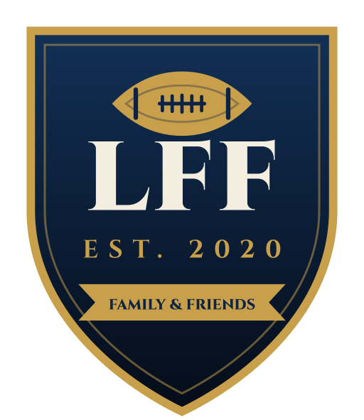
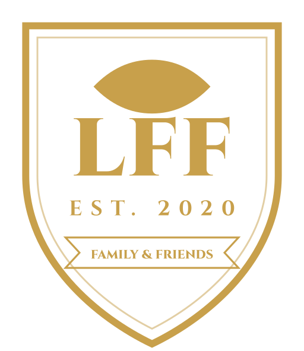
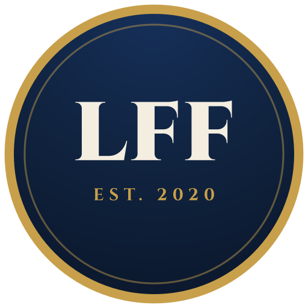
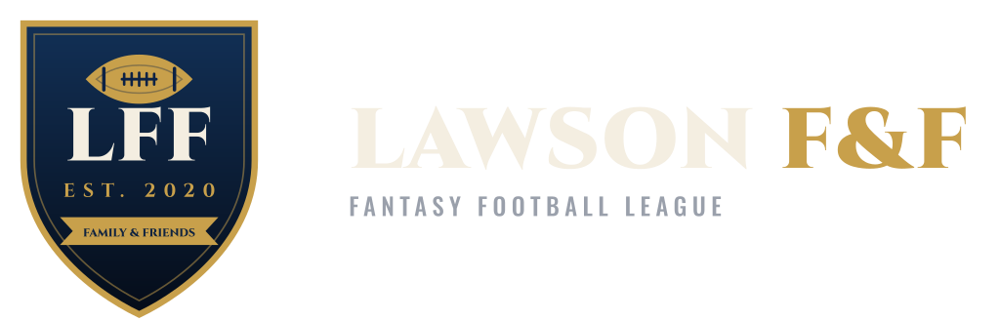

<div align="center">



# Lawson League Brand Kit

**The single source of truth for the Lawson Family &amp; Friends Fantasy Football League.**
Logos, fonts, colours, and every template needed to make a newsletter, an
announcement, or a graphic without starting from scratch.

*12 teams · Est. 2020 · Season VI*

</div>

---

## What's in here

| | |
|---|---|
| **[`assets/logo/`](assets/logo/)** | 16 vector marks + 41 PNG exports. All lettering outlined — no font dependency. |
| **[`assets/fonts/`](assets/fonts/)** | Cinzel, Oswald, Barlow Condensed, Barlow. Self-hosted, SIL OFL. |
| **[`tokens/`](tokens/)** | Colours, type, space, shadows — as CSS, JSON, and Sass. |
| **[`templates/`](templates/)** | 10 ready-to-fill layouts. |
| **[`data/`](data/)** | A worked example for every template. |
| **[`BRAND.md`](BRAND.md)** | The guideline: usage rules, clear space, misuse, voice. |
| **[`.claude/skills/lawson-league/`](.claude/skills/lawson-league/)** | Claude Code skill — ask for content in plain English. |

## Quickest possible start

```bash
npm install
node scripts/render.js power-rankings data/example-power-rankings.json --png
# → output/power-rankings.png
```

Or just ask Claude Code, from anywhere in this repo:

> "Make Week 5 power rankings. Sofa Kings still 1, Turf Titans still last."

The skill picks the template, writes the copy in the league's voice, fills the
data, and renders the PNG.

## The marks

<div align="center">

 &nbsp;
 &nbsp;




</div>

| File | Use |
|---|---|
| `crest-full.svg` | Primary crest |
| `crest-flat.svg` | Print / screen print (no gradient) |
| `crest-mono-{gold,navy,cream,white,black}.svg` | One-colour: embroidery, stamps, watermarks |
| `lockup-primary.svg` | Crest + wordmark, horizontal — the default signature |
| `lockup-stacked.svg` | Crest above wordmark |
| `wordmark-on-{dark,light}.svg` | Type only |
| `monogram-badge.svg` | Circular badge — avatars, mastheads |
| `favicon.svg` | **Anything under 48px** |

Add `-on-light` to a lockup for the cream-background version. PNGs live in
[`assets/logo/png/`](assets/logo/png/) at 256/512/1024/2048, plus `-on-navy`
and `-on-cream` flattened copies.

> [!IMPORTANT]
> All crest lettering is **outlined paths, not live text**. The original design
> export used `font-family="Cinzel"`, which silently fell back to Times on any
> machine without Cinzel installed. These files render identically everywhere.

## Colour

| | Token | Hex | |
|---|---|---|---|
|  | `--navy-700` | `#10233F` | The brand navy |
|  | `--navy-900` | `#081121` | Deepest ground |
|  | `--gold-500` | `#C8A04B` | The brand gold |
|  | `--gold-400` | `#E0BD6D` | Lighter gold |
|  | `--cream-100` | `#F4EEE1` | Headings, text on navy |
|  | `--red-500` | `#B0303C` | Alerts, losses, the cut line |
|  | `--positive` | `#4a9d6a` | Wins, upward movement |

Gold marks the single most important thing in a view. When everything is gold,
nothing is.

## Type

| Role | Family | Where it goes |
|---|---|---|
| Crest | **Cinzel** 800–900 | Crest, team names, champion — engraved feel |
| Display | **Oswald** 500–600 | Uppercase broadcast headlines, big numbers |
| Label | **Barlow Condensed** 700 | The signature all-caps label, `letter-spacing: .18em` |
| Body | **Barlow** 400 | Running copy |
| Numeral | **Oswald** 600 | Scores and ranks, tabular |

Self-hosted in [`assets/fonts/`](assets/fonts/) — 237 KB for all four, no CDN
needed. Link `fonts.css` before `tokens.css`.

## Templates

| Template | What it's for |
|---|---|
| [`newsletter`](templates/newsletter.html) | **The Lawson Ledger** — weekly recap |
| [`email-newsletter`](templates/email-newsletter.html) | Same, built for Gmail/Outlook |
| [`power-rankings`](templates/power-rankings.html) | 1–12 with movement and a roast each |
| [`standings`](templates/standings.html) | W-L, PF/PA, playoff cut line |
| [`draft-board`](templates/draft-board.html) | Draft order, round 1 |
| [`flyer`](templates/flyer.html) | Draft night and other events (680×960) |
| [`transaction-card`](templates/transaction-card.html) | Trades, waivers, drops |
| [`awards`](templates/awards.html) | End-of-season hardware |
| [`season-wrap`](templates/season-wrap.html) | The long season-in-review |
| [`chat-card`](templates/chat-card.html) | **800×800 cards for the group chat** — 5 variants |

Each file opens with its own data contract. Copy the matching
`data/example-*.json` and edit.

### Chat cards

Built for how the league actually talks. Square so no client letterboxes them,
with type sized to survive being seen as a 250px thumbnail.

```bash
node scripts/render.js chat-card data/example-chat-cards.json --png
```

`_clips` in the data file picks which of the five variants to export.

## Using the assets elsewhere

Because this repo is public, any file works as a direct URL — which is how the
email template embeds the logo:

```
https://raw.githubusercontent.com/hwlaw54/lawson-league-brand/main/assets/logo/png/crest-full-512.png
```

## Scripts

| | |
|---|---|
| `node scripts/render.js <template> <data> --png` | Fill a template, export |
| `node scripts/build-logos.js` | Regenerate every SVG from the crest definition |
| `node scripts/build-pngs.js` | Re-export the PNG ladder |
| `node scripts/fetch-fonts.js` | Re-download the typefaces |

Rendering needs Chrome or Edge installed. Set `LFF_BROWSER` if it isn't found
automatically.

---

<div align="center">
<sub><b>Lawson Family &amp; Friends Fantasy League</b> · Est. 2020 · Trophy or bust</sub>
</div>
